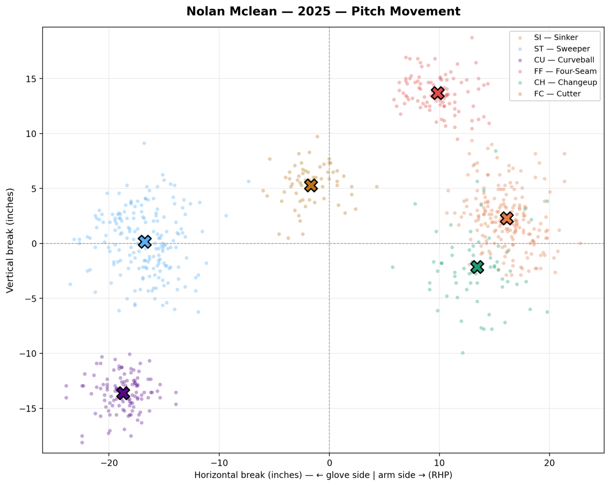
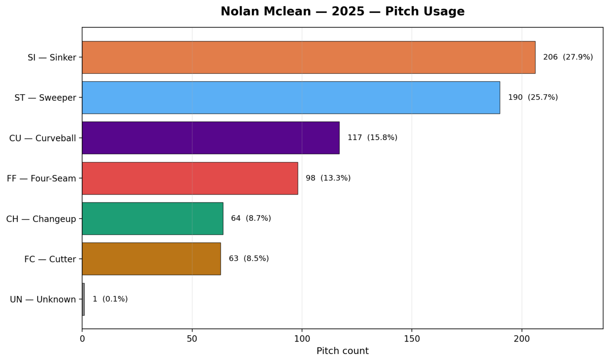
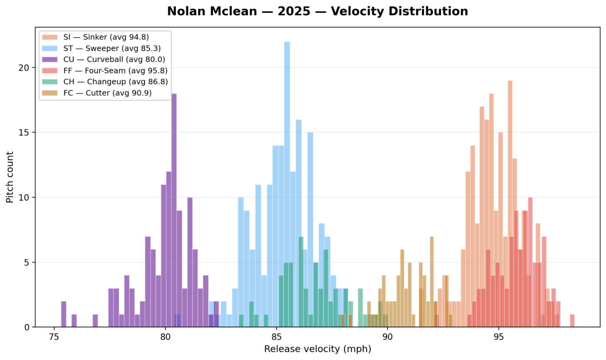

# Pitch Visualizer
An interactive Streamlit app for exploring any MLB pitcher's arsenal using
Statcast data. Search a pitcher, pick one or more seasons, and generate
visualizations of their pitch movement, velocity distribution, and usage.

## Features

- Pitcher search by full name, last name, or "Last, First"
- Multi-season selection (Statcast era: 2015–present)
- Three chart types: pitch movement, velocity distribution, usage breakdown
- Handedness-aware horizontal break (arm side / glove side adjusted for LHP/RHP)
- Per-pitch summary table with velocity, spin rate, and movement averages
- CSV export of summary data

## Setup
   
```
   pip install -r requirements.txt
   streamlit run pitch_visualizer.py
```

## Data source

MLB Statcast via [pybaseball](https://github.com/jldbc/pybaseball).

## Tools used

- Python 3
- Streamlit
- pybaseball
- pandas
- matplotlib

## Sample Output

(using Nolan McLean's 2025 Season)

- 
- 
- 
